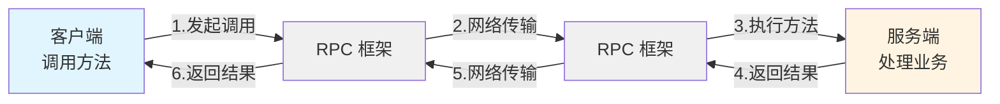

# 2026年最新RPC学习路线零基础到精通一条龙（万人收藏⭐️）

> 编程导航学习网站：[学编程、做项目、拿 Offer！](https://www.codefather.cn)
> 
> 企业高频面试题库：[开始刷题，面试遇原题！](https://www.mianshiya.com)
>
> 精选简历模板大全：[1 分钟搞定简历！](https://www.laoyujianli.com)
>
> AI 资源导航网站：[获取最新 AI 黑科技！](https://ai.codefather.cn)
>
> 1 对 1 模拟面试：[随时随地提升面试能力](https://ai.mianshiya.com)

RPC 求职高频面试题：[开始刷题](https://www.mianshiya.com/bank/1773293162043891714)

## 开篇介绍

⭐️ 建议通过鱼皮的视频，2 分钟了解 RPC：https://www.bilibili.com/video/BV1y2aPzJEZY/

RPC（Remote Procedure Call，远程过程调用）是分布式系统中最核心的通信技术之一。简单来说，RPC 让你可以像调用本地方法一样调用远程服务器上的方法，就好比你在家里打了个电话，电话那头的人帮你完成了一件事，然后把结果告诉你。这种 “隔空喊话” 的能力，正是微服务架构和分布式系统的基石。

随着微服务架构的普及，系统被拆分成了许多小服务，这些服务之间需要频繁通信。RPC 框架正是为了解决这个问题而生的。它隐藏了网络通信的复杂性，让开发者能够专注于业务逻辑，而不用操心底层的序列化、网络传输、负载均衡等问题。

**为什么要学 RPC？**

如果你想从事后端开发、微服务架构设计或者大厂工作，RPC 是绕不开的技术。主流的 RPC 框架如 gRPC、Dubbo、Thrift 在各大公司广泛应用，掌握 RPC 不仅能让你理解微服务架构的精髓，还能大幅提升你的系统设计能力。更重要的是，RPC 的设计思想（如序列化、网络通信、服务治理）是通用的，学会 RPC 能让你更深刻地理解分布式系统。

**RPC 能解决什么问题？**

核心就是 4 个字 —— 服务调用。在分布式系统中，不同的服务可能部署在不同的机器上，甚至使用不同的编程语言。RPC 框架让这些服务能够无缝通信，实现系统解耦、提高复用性、支持跨语言调用。无论是电商系统的订单服务调用库存服务，还是社交平台的消息服务调用用户服务，背后都是 RPC 在支撑。

在 AI 时代，RPC 也在发挥着重要作用。AI 模型推理服务、向量数据库查询、分布式训练任务调度等，都可以利用 RPC 高效通信。学习 RPC，将为你的技术栈增加重要的一环，让你能够构建更加强大和灵活的分布式系统。

### 学习路线图

### 就业方向

RPC 是后端开发、架构师等岗位的核心技能，掌握 RPC 后对下列岗位很有帮助：

1. Java 后端开发工程师：使用 Dubbo、gRPC 等框架开发微服务应用
2. Go 后端开发工程师：使用 gRPC 构建高性能服务
3. 微服务架构师：设计基于 RPC 的微服务架构，负责服务治理
4. 中间件开发工程师：开发和维护 RPC 框架及相关中间件
5. 系统架构师：设计大规模分布式系统，解决服务通信问题

## 整体学习建议

1）先理解为什么需要 RPC？

很多同学一上来就学框架，但不理解为什么要用 RPC。建议先思考分布式系统中服务调用的痛点，理解 RPC 解决了什么问题。

2）从实践到原理：建议先快速上手一个 RPC 框架（推荐 gRPC 或 Dubbo），体验 RPC 的使用流程，然后再深入学习底层原理。

3）**手写 RPC 框架是最好的学习方式！**

理论学习只能让你知道 RPC 是什么，只有动手实现一个简单的 RPC 框架，才能真正理解 RPC 的工作原理和设计思想。强烈推荐 [鱼皮的手写 RPC 框架教程](https://www.codefather.cn/course/1768543954720022530)。非常详细，从简易版到扩展版，循序渐进，适合零基础学习。教程使用了 Vert.x、Etcd、Kryo 等新颖的技术，做完这个项目能学到很多东西。

如图，整整 12 节详细的保姆级教程：

4）对比学习不同的 RPC 框架：gRPC、Dubbo、Thrift 各有特点，建议至少深入学习一个，了解其他几个的特点和适用场景，这样在技术选型时才能做出正确的判断。

5）善用 AI 工具：学习 RPC 时可以用 AI 工具（如 ChatGPT、Cursor）辅助理解概念、生成代码、调试问题。可以使用 [AI 资源大全](https://ai.codefather.cn/) 来获取到很多实用的 AI 工具。

## 阶段 1：分布式系统基础（3-5 天）

### 学习目标

理解分布式系统的基本概念，为学习 RPC 打下基础。

### 知识点

**分布式系统基本概念【必学】：**

- 什么是分布式系统
- 分布式系统的特点和挑战
- CAP 理论和 BASE 理论【建议学】
- 分布式系统中的通信方式

**服务化架构【必学】：**

关于微服务架构的详细学习，可以查看 [Spring Cloud 微服务学习路线](https://www.codefather.cn/course/1789189862986850306/section/1990754562939596801)

- 单体架构 vs 微服务架构
- 服务拆分的原则
- 服务之间的通信方式（HTTP、RPC、消息队列）

**为什么需要 RPC【必学】：**

- HTTP 调用的局限性
- RPC 的优势（高性能、跨语言、服务治理）
- RPC 的应用场景

### 学习建议

1）这个阶段 **不需要深入学习分布式系统的所有知识**，重点理解为什么需要 RPC，以及 RPC 在分布式系统中的作用。

2）如果你已经有微服务开发经验，可以快速过这个阶段。如果没有，建议花 2-3 天时间理解分布式系统的基本概念。

3）很多同学会直接跳过这个阶段，但这会导致后续学习时不理解为什么要这样设计。建议至少花一天时间思考：**为什么要用 RPC 而不是 HTTP？RPC 解决了什么问题？**

### 学习资源

- ⭐ [鱼皮的 RPC 知识科普视频](https://www.bilibili.com/video/BV1y2aPzJEZY/)：快速理解 RPC 的核心概念

## 阶段 2：RPC 原理入门（5-7 天）

### 学习目标

理解 RPC 的核心原理和组成部分，掌握 RPC 的基本工作流程。

### 知识点

**RPC 核心原理【必学】：**

- RPC 的定义和特点
- RPC 的调用流程（客户端 → 网络 → 服务端）
- RPC 的核心组件（客户端 Stub、服务端 Skeleton、网络传输、注册中心）

**序列化和反序列化【必学】：**

- 什么是序列化和反序列化
- 为什么需要序列化
- 常见的序列化方式对比
  - JSON：可读性好，但性能较低
  - Protocol Buffers（Protobuf）：性能高，但需要定义 Schema
  - Hessian：Java 领域常用
  - Kryo：性能优秀
  - Thrift：跨语言序列化

**网络通信【必学】：**

- 基于 TCP 的 RPC 通信
- 基于 HTTP/2 的 RPC 通信（gRPC）
- 同步调用 vs 异步调用
- 长连接 vs 短连接

**动态代理【必学】：**

- 什么是动态代理
- Java 动态代理（JDK 动态代理、CGLIB）
- 动态代理在 RPC 中的应用

**服务注册和发现【必学】：**

- 什么是服务注册和发现
- 常见的注册中心（Nacos、Zookeeper、Consul、Etcd）
- 服务注册、服务发现、服务下线的流程

### 学习建议

1）RPC 的核心原理并不复杂，关键是理解序列化、网络通信、动态代理这几个核心概念。建议先看视频理解概念，再动手写代码验证。

2）序列化是 RPC 的核心，要理解不同序列化方式的优缺点。Protobuf 是目前最流行的序列化方式，建议重点学习。

3）动态代理是 RPC 客户端的核心技术，它让我们可以像调用本地方法一样调用远程方法。建议动手写一个简单的动态代理示例，理解其工作原理。

4）服务注册和发现是 RPC 框架的重要组成部分，但在学习阶段可以简化，先理解概念即可。

### 经典面试题

1. RPC 的调用流程是怎样的？
2. 常见的序列化方式有哪些？各有什么优缺点？
3. 什么是动态代理？RPC 中为什么要用动态代理？
4. 什么是服务注册和发现？为什么需要注册中心？

### 学习资源

- [Protocol Buffers 官方文档](https://protobuf.dev/)：学习 Protobuf 序列化

## 阶段 3：主流 RPC 框架学习（10-15 天）

主流 RPC 框架如 Dubbo、gRPC 等，提供了完善的远程调用解决方案，是分布式系统开发的核心工具。

### 学习目标

掌握至少一个主流 RPC 框架的使用，理解不同框架的特点和适用场景。

### 知识点

**gRPC【必学】：**

- gRPC 简介和特点
- Protocol Buffers 的使用
- gRPC 服务端和客户端的编写
- gRPC 的四种调用方式（简单 RPC、服务端流、客户端流、双向流）
- gRPC 的拦截器（Interceptor）【建议学】
- gRPC 的负载均衡【建议学】

**Dubbo【建议学】：**

- Dubbo 简介和特点
- Dubbo 的架构设计
- Dubbo 服务的定义和发布
- Dubbo 服务的引用和调用
- Dubbo 的服务治理功能（负载均衡、服务降级、限流）

**Apache Thrift【可不学】：**

- Thrift 简介和特点
- Thrift IDL 的定义
- Thrift 服务端和客户端的编写

### 框架选择建议

- **gRPC**：
  - 优点：Google 出品、性能优秀、跨语言支持好、基于 HTTP/2
  - 缺点：国内生态相对较小
  - 适用场景：跨语言服务调用、微服务架构、云原生应用
  - 推荐指数：⭐⭐⭐⭐⭐（必学）

- **Dubbo**：
  - 优点：阿里出品、Java 生态完善、服务治理功能强大
  - 缺点：主要支持 Java，其他语言支持较弱
  - 适用场景：Java 微服务架构、Spring Cloud Alibaba 技术栈
  - 推荐指数：⭐⭐⭐⭐（Java 方向必学）

- **Thrift**：
  - 优点：Facebook 出品、跨语言支持、性能优秀
  - 缺点：社区活跃度下降、文档较少
  - 适用场景：老项目维护、特定场景
  - 推荐指数：⭐⭐（可选学习）

### 学习建议

1）建议选择 gRPC 或 Dubbo 中的一个深入学习，两者都学习更好。如果时间有限，优先学习 gRPC，因为它的应用更广泛。

2）学习 RPC 框架最好的方式是动手写代码。建议搭建一个简单的微服务项目，使用 RPC 框架实现服务间的调用。

3）gRPC 的四种调用方式要都体验一遍，理解流式 RPC 的应用场景。很多同学只学习简单 RPC，但流式 RPC 在某些场景下非常有用（如文件传输、实时数据流）。

4）Dubbo 的服务治理功能非常强大，如果你使用 Dubbo，建议深入学习负载均衡、服务降级、限流等功能。

### 学习资源

**gRPC：**

- ⭐ [gRPC 官方文档](https://grpc.io/docs/)：最权威的学习资源
- ⭐ [【狂神 gRPC 教程](https://www.bilibili.com/video/BV1S24y1U7Xp)：超详细版
- [gRPC 入门指南](https://www.grpc.io/docs/languages/go/quickstart/)：官方快速入门

**Dubbo：**

- ⭐ [Dubbo 官方文档](https://cn.dubbo.apache.org/zh-cn/)：官方中文文档
- [黑马程序员 Dubbo 教程](https://www.bilibili.com/video/BV1VE411q7dX/)：适合零基础
- [尚硅谷 Dubbo 教程](https://www.bilibili.com/video/BV1ns411c7jV/)：深入讲解 Dubbo 原理

### 练手项目

- [gRPC 官方示例](https://github.com/grpc/grpc/tree/master/examples)：官方提供的示例代码
- [Dubbo 官方示例](https://github.com/apache/dubbo-samples)：官方提供的示例代码

## 阶段 4：手写 RPC 框架（7-10 天）

### 学习目标

从零开始手写一个简单的 RPC 框架，深入理解 RPC 的设计思想和实现细节，包括序列化、网络通信、服务注册等核心功能。

### 知识点

**RPC 框架核心功能【必学】：**

- 服务注册：服务提供者将服务信息注册到注册中心
- 服务发现：服务消费者从注册中心获取服务信息
- 动态代理：客户端通过动态代理生成代理对象
- 序列化：将请求和响应对象序列化为字节流
- 网络传输：通过 Socket 或 Netty 实现网络通信
- 反射调用：服务端通过反射调用真实的服务方法

**扩展功能【建议学】：**

- 负载均衡：支持多种负载均衡策略（随机、轮询、一致性哈希）
- 容错机制：失败重试、降级处理
- 序列化器扩展：支持多种序列化方式
- 自定义协议：设计高效的 RPC 通信协议
- SPI 机制：支持框架的扩展

### 学习建议

1）手写 RPC 框架是学习 RPC 最好的方式，强烈建议跟着 [鱼皮的手写 RPC 框架教程](https://www.codefather.cn/course/1768543954720022530) 动手实现一遍。

[鱼皮的手写 RPC 框架教程](https://www.codefather.cn/course/1768543954720022530) 非常详细，从简易版到扩展版，循序渐进，适合零基础学习。教程使用了 Vert.x、Etcd、Kryo 等新颖的技术，做完这个项目能学到很多东西。

如图，整整 12 节详细的保姆级教程：

即使你不打算深入研究 RPC 框架，手写一遍也能让你对 RPC 的原理有深刻的理解。

2）手写 RPC 框架的过程中，你会遇到很多细节问题（如粘包半包、序列化异常等），不要气馁，这些都是正常的。遇到问题时可以用 AI 工具辅助调试。

3）完成基础功能后，建议尝试实现一些扩展功能，如负载均衡、容错机制等。这些功能能让你的 RPC 框架更接近生产级别，也能让你的简历更有亮点。

### 学习资源

- ⭐ [鱼皮的手写 RPC 框架教程](https://www.codefather.cn/course/1768543954720022530)：保姆级教程，从 0 到 1 带你实现 RPC 框架
- ⭐ [手写 RPC 框架导学视频](https://www.bilibili.com/video/BV1AJ4m1H7XL/)：快速了解项目内容
- [手写 RPC 框架源码](https://github.com/liyupi/yu-rpc)：开源代码，可以参考

### 练手项目

- ⭐ [鱼皮的手写 RPC 框架项目](https://www.codefather.cn/course/1768543954720022530)：跟着教程实现一个完整的 RPC 框架，包含简易版和扩展版

## 阶段 5：RPC 高级特性（7-10 天）

### 学习目标

掌握 RPC 框架的高级特性和生产实践，能够解决实际项目中的问题。

### 知识点

**负载均衡【必学】：**

- 常见的负载均衡算法（随机、轮询、加权轮询、一致性哈希）
- 如何选择负载均衡策略
- 负载均衡的实现原理

**容错机制【必学】：**

- Failover：失败自动切换
- Failfast：快速失败
- Failsafe：失败安全（忽略失败）
- Failback：失败自动恢复
- 重试机制的设计

**服务治理【建议学】：**

- 服务降级：当服务不可用时，返回默认值或执行备用逻辑
- 服务熔断：当服务频繁失败时，自动切断调用
- 服务限流：限制服务的调用频率
- 服务监控：监控服务的调用情况

**性能优化【建议学】：**

- 连接池复用
- 请求合并（批量调用）
- 异步调用
- 超时控制
- 压缩传输

**安全性【建议学】：**

- 认证和授权
- 传输加密（TLS/SSL）
- 接口鉴权

### 学习建议

1）负载均衡和容错机制是 RPC 框架的核心功能，也是面试的重点。要理解不同策略的适用场景，以及如何根据业务需求选择合适的策略。

2）一致性哈希是一个重要的负载均衡算法，在分布式缓存、分布式存储中广泛应用。建议深入理解其原理和实现。

3）服务治理功能在大规模微服务架构中非常重要。如果你使用 Dubbo，建议深入学习 Dubbo 的服务治理功能。如果使用 gRPC，可以结合 Istio 等服务网格来实现服务治理。

4）性能优化是一个持续的过程，要根据实际的性能瓶颈进行优化。常见的优化手段包括连接池复用、异步调用、压缩传输等。

### 经典面试题

1. RPC 框架如何实现负载均衡？常见的负载均衡策略有哪些？
2. 什么是一致性哈希？它解决了什么问题？
3. RPC 调用失败后如何处理？有哪些容错机制？
4. 如何保证 RPC 调用的高可用？
5. RPC 框架如何实现服务降级和熔断？

### 学习资源

- [Dubbo 负载均衡和容错机制](https://cn.dubbo.apache.org/zh-cn/overview/core-features/load-balance/)：Dubbo 官方文档

## 阶段 6：生产实践和求职（7-10 天）

### 学习目标

将 RPC 框架应用到实际项目中，准备面试和求职。

### 知识点

**生产环境部署【建议学】：**

- RPC 服务的部署和监控
- 日志收集和分析
- 性能监控和调优
- 故障排查和恢复

**微服务架构实践【建议学】：**

- RPC 在微服务架构中的应用
- RPC vs REST vs GraphQL
- 服务网格（Service Mesh）【可不学】
- 云原生 RPC（gRPC + Kubernetes）【可不学】

**简历和面试准备【必学】：**

- 如何在简历中描述 RPC 项目
- RPC 相关的高频面试题
- 项目经验的整理和表达

### 学习建议

1）如果有实际项目，建议尝试将 RPC 框架应用到项目中。如果没有，可以自己搭建一个简单的微服务项目进行实践。

2）手写 RPC 框架项目是一个很好的简历亮点。建议将项目完善后放到 GitHub，并在简历中详细描述项目的功能和技术难点。鱼皮的手写 RPC 框架教程提供了 20 多个简历亮点，可以直接使用。

3）RPC 相关的面试题要好好准备，特别是负载均衡、容错机制、序列化等核心知识点。建议刷一遍面试鸭的 RPC 面试题。

4）面试时要能够清晰地描述 RPC 的工作原理、你做的 RPC 项目的技术难点、以及你是如何解决问题的。建议提前准备好项目介绍的话术。

### 经典面试题

**基础理论：**

1. 什么是 RPC？RPC 和 HTTP 有什么区别？
2. RPC 的调用流程是怎样的？
3. 为什么要用 RPC 而不是 HTTP？

**技术实现：**

1. RPC 框架如何实现序列化和反序列化？
2. RPC 框架如何实现动态代理？
3. RPC 框架如何实现服务注册和发现？
4. RPC 框架如何实现负载均衡？

**高级特性：**

1. 如何保证 RPC 调用的高可用？
2. RPC 调用失败后如何处理？
3. 如何优化 RPC 的性能？
4. 如何保证 RPC 调用的安全性？

**系统设计：**

1. 如何设计一个高可用的 RPC 框架？
2. 如何设计一个支持跨语言调用的 RPC 框架？
3. 微服务架构中如何使用 RPC？

### 面试题库

- ⭐ [RPC 面试题 - 面试鸭](https://www.mianshiya.com/bank/1773293162043891714)：全面的 RPC 面试题
- [分布式系统面试题 - 面试鸭](https://www.mianshiya.com/bank/1991433644421414913)：分布式相关面试题
- [微服务架构面试题 - 面试鸭](https://www.mianshiya.com/bank/1991433816622759937)：微服务相关面试题

### 求职资源

- ⭐ [鱼皮的保姆级求职指南](https://www.codefather.cn/course/job)：从简历到面试的完整指南
- ⭐ [鱼皮的保姆级写简历指南](https://www.codefather.cn/course/1802644557818343425)：如何写出高质量简历
- [编程导航的求职干货分享](https://www.codefather.cn/learn?category=76&type=2)：求职经验和技巧
- [老鱼简历](https://www.laoyujianli.com/)：写简历工具 + 简历模板大全
- [真实面经大全](https://www.codefather.cn/job/experience)：了解真实的面试流程
- [几百场真实面试视频](https://www.codefather.cn/mockInterview)：观看他人的面试过程
- [1 对 1 模拟面试](https://ai.mianshiya.com/)：AI 模拟面试练习
- [面试题讲解视频](https://space.bilibili.com/3546383483144655)：面试鸭官方题解

## 持续学习资源

### 官方文档

- [gRPC 官方文档](https://grpc.io/docs/)：gRPC 官方文档
- [Dubbo 官方文档](https://cn.dubbo.apache.org/zh-cn/)：Dubbo 官方中文文档
- [Apache Thrift 官方文档](https://thrift.apache.org/docs/)：Thrift 官方文档

### 知名 RPC 框架

- ⭐ [Apache Dubbo](https://github.com/apache/dubbo)：阿里巴巴开源的高性能 RPC 框架，生产级微服务框架（41.6k+ stars）
- [gRPC](https://github.com/grpc/grpc)：Google 开源的高性能 RPC 框架，支持多种语言（42k+ stars）
- [rpcx](https://github.com/smallnest/rpcx)：Go 语言 RPC 框架，类似 Dubbo（8k+ stars）

### 知识总结

- ⭐ [编程导航](https://www.codefather.cn/)：学习路线、项目教程、面试题、编程资源一站式平台
- [消息队列学习路线](https://www.codefather.cn/course/1789189862986850306/section/1990755245742927874)：和 RPC 结合使用的消息队列学习路线
- [微服务架构学习路线](https://www.codefather.cn/course/1789189862986850306/section/1990754562939596801)：深入理解微服务架构

### 技术博客

- [Uber Engineering Blog](https://www.uber.com/blog/engineering/)：Uber RPC 架构实践
- [Netflix TechBlog](https://netflixtechblog.com/)：Netflix 服务间通信
- [美团技术团队](https://tech.meituan.com/)：RPC 和微服务相关文章
- [阿里技术团队](https://developer.aliyun.com/group/)：Dubbo 相关技术文章

### 开源项目

- [gRPC](https://github.com/grpc/grpc)：gRPC 官方仓库
- [Apache Dubbo](https://github.com/apache/dubbo)：Dubbo 官方仓库
- [鱼皮的手写 RPC 框架](https://github.com/liyupi/yu-rpc)：鱼皮开源的 RPC 框架

## 写在最后

RPC 是分布式系统的核心技术，掌握 RPC 不仅能让你理解微服务架构的精髓，还能大幅提升你的系统设计能力。

学习 RPC 建议先理解原理，再动手实践。强烈推荐跟着鱼皮的手写 RPC 框架教程从 0 到 1 实现一个 RPC 框架，这是最好的学习方式。同时，建议至少深入学习一个主流 RPC 框架（gRPC 或 Dubbo），并在实际项目中应用。

希望这份学习路线能够帮助大家系统地掌握 RPC 技术，为后续学习微服务架构和分布式系统打下坚实的基础。

加油小伙伴们 💪🏻！

## 程序员必备资源

1）程序员学习交流圈：[极客教程、实战项目、求职宝典](https://www.codefather.cn)

2）程序员面试八股文：[实习/校招/社招高频考点、企业真题解析](https://www.mianshiya.com)

3）程序员写简历神器：[专业模板、丰富例句、直通面试](https://www.laoyujianli.com)

4）AI 知识资源大全：[前沿技术、最新 AI 资讯、提示词大全](https://ai.codefather.cn)

5）1 对 1 模拟面试：[实习/校招/社招面试拿 Offer 必备](https://ai.mianshiya.com)
