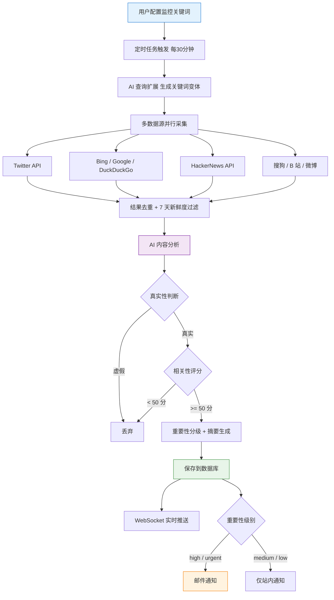
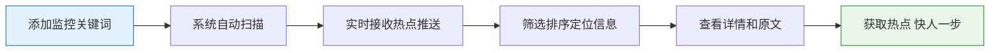
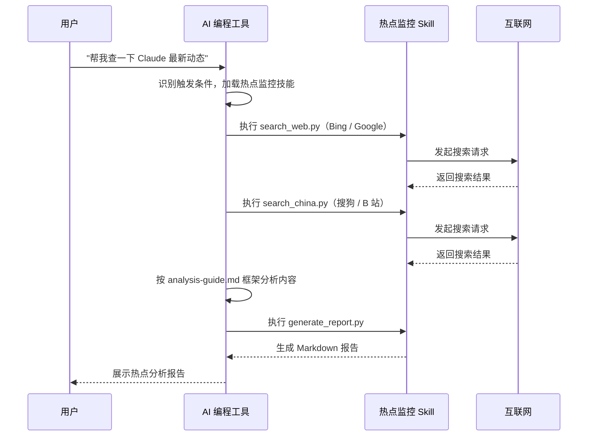

# AI 热点监控工具项目（26年最新）

## 一、项目介绍

这是一套以 **AI 编程实战** 为核心的项目教程，基于 Express 5 + React 19 + OpenRouter + Socket.io，用 AI 编程的方式从 0 到 1 开发一个《AI 热点监控工具》，带你亲身体验 AI Vibe Coding 的完整工作流，学会用 AI 快速做出实用的提效工具！

⭐️ 项目代码 100% 开源：[https://github.com/liyupi/yupi-hot-monitor](https://github.com/liyupi/yupi-hot-monitor)

### 为什么做这个项目？

鱼皮作为 AI 编程博主，要利用工具第一时间自动发现最新的热点（比如 AI 大模型的更新），并且及时给我发送通知，让我能够走在吃瓜第一线。

这就是 AI 热点监控工具的起点：输入要监控的关键词，系统自动从 Twitter、Bing、HackerNews、搜狗、B 站等 **8+** 个信息源聚合抓取内容，利用 AI 进行真假识别和相关性分析，并通过 WebSocket 实时推送和邮件通知用户。此外，还将热点监控能力封装为 **Agent Skills 技能包**，让其他 AI 编程工具也能用上这个能力。

**让 AI 帮你盯热点，第一时间获取优质信息！**

## 二、项目功能演示

1）配置监控关键词

用户输入要监控的关键词，比如 "Vibe Coding"、"Claude" 等，系统会自动开始监控。支持激活 / 暂停单个关键词。

2）AI 自动抓取和分析热点

系统每 30 分钟自动从 Twitter、Bing、HackerNews、搜狗、B 站、微博等 8+ 个信息源抓取内容，利用 AI 进行查询扩展、真假识别、相关性分析和智能摘要，过滤低质量内容后展示在信息流中。

3）多维度筛选和排序

支持按信息来源、重要性、时间范围进行筛选，支持按热度综合、相关性、发布时间排序，帮助用户快速定位需要的热点信息。

4）全网搜索

除了监控关键词的实时热点流外，还可以直接搜索特定的关键词，从全网获取信息：

5）实时通知

通过 WebSocket 实时推送热点通知，高重要性的热点还会通过邮件通知：

6）Agent Skills 技能包

将热点监控能力封装为标准的 Agent Skills，安装后在 Cursor、VSCode Copilot、Claude Code 等 AI 编程工具中都能使用：

## 三、项目优势

### 项目收获

本项目选题新颖，紧跟 AI 编程时代，以 **实用工具开发** 为导向，区别于增删改查的烂大街项目。你不是在写代码，而是在用 AI 做一个真正有价值的工具。

项目内容精炼，**不到一周就能学完**，快速掌握 AI 编程的核心工作流：需求分析 → 方案设计 → 编码开发 → 测试验证 → 前后端优化 → 功能扩展 → Skills 开发，让你真正体验企业级 AI 编程的全流程。

从这个项目中你可以学到：

- 如何用 AI 编程从 0 到 1 开发一个完整的工具？
- 如何安装和使用 MCP 增强 AI 能力？
- 如何安装和使用 Agent Skills 提升 AI 编程质量？
- 如何从多个信息源（Twitter、Bing、HN、B 站等）聚合抓取内容？
- 如何通过 OpenRouter 接入 AI 大模型，实现智能内容审核？
- 如何实现查询扩展（Query Expansion），提高信息检索的召回率？
- 如何基于 Socket.io 实现 WebSocket 实时推送？
- 如何使用 Aceternity UI 打造炫酷的科技感前端界面？
- 如何开发标准化的 Agent Skills 技能包，并在多种 AI 工具中验证？
- 如何在 AI 编程中进行人工确认、版本控制和迭代优化？

### 这个项目特别适合谁？

- 想学 AI 编程（Vibe Coding），但不知道从哪个项目入手
- 想做工具类产品，学会用 AI 快速开发实用工具
- 想掌握多信息源数据聚合和网页爬虫技术
- 想了解 AI 内容审核和智能分析应用
- 想学习 Agent Skills 开发，扩展 AI 编程工具能力

鱼皮的项目帮很多同学拿到了大厂高薪 Offer：

### 鱼皮系列项目优势

鱼皮原创项目系列以 **实战视频教程** 为主，从 0 到 1 带做，涵盖企业级 Java 后端 + 前端全栈项目、最新 AI 应用开发 + AI 编程项目、大厂架构进阶项目。已有 **20 多套** 保姆级项目教程，并提供现成的源码、简历写法和面试题解，帮你用最快的速度学会做项目、写满简历、拿到 Offer。

此外，加入后还可享受以下服务：

| 教程资料                     | 求职助力                       |
| ---------------------------- | ------------------------------ |
| 详细的文字教程 / 直播笔记    | ⭐️ 现成的简历写法，直接写满简历 |
| 完整的项目源码               | ⭐️ 项目相关面试题解和真实面经   |
| 1 对 1 答疑解惑 + 专属交流群 | ⭐️ 项目扩展思路，拉开区分度     |
| 前端 + Java 后端万用项目模板 | ⭐️ 从学项目到拿 Offer 一条龙    |

比起看网上的教程自学，鱼皮项目系列的优势：学知识 → 做项目 → 答疑解惑 → 简历写法 → 面试题解，一条龙服务！

编程导航已有 **20+ 套项目教程！** 每个项目的学习重点不同，几乎全都是前端 + 后端的 **全栈项目**。

详细请见：[https://codefather.cn/course](https://www.codefather.cn/course)（在该页面右侧有项目推荐和学习建议）

往期项目介绍视频：[https://bilibili.com/video/BV1YvmbYbEgS](https://www.bilibili.com/video/BV1YvmbYbEgS/)

## 四、核心业务流程

### 热点监控主流程

整个项目的核心流程比较复杂：用户配置关键词 → 定时任务触发 → AI 查询扩展 → 多源抓取 → 去重过滤 → AI 分析 → 入库 → 实时推送/邮件通知。

### Web 端使用流程

用户使用网页来监控热点：

### Agent Skills 使用流程

用户安装热点监控 Skills 后，可以直接在 AI 编程工具中通过自然语言触发热点搜索和分析：

## 五、项目功能梳理

该项目功能丰富，涵盖关键词管理、热点采集和分析、信息展示和筛选、实时通知系统、全网信息源搜索、Agent Skills 六大模块，20+ 功能点，覆盖了从信息采集、AI 智能分析到实时推送通知的完整热点监控闭环。

关键词管理模块：

- 添加 / 删除监控关键词
- 激活 / 暂停单个关键词
- AI 自动扩展查询变体（Query Expansion）
- B 站账号智能检测

热点采集与分析模块：

- 8+ 数据源并行采集（Twitter、Bing、搜狗、B 站、微博、HackerNews 等）
- AI 内容真实性验证（过滤标题党和虚假内容）
- AI 相关性评分（0-100 分）
- AI 重要性分级（urgent / high / medium / low）
- AI 智能摘要生成
- AI 相关性分析理由

信息展示与筛选模块：

- 热点雷达仪表盘（实时统计数据）
- 5 种排序方式（最新发现 / 最新发布 / 重要程度 / 相关性 / 热度综合）
- 多维度筛选（来源 / 重要性 / 关键词 / 时间范围）
- 分页加载
- 展开 / 折叠相关性分析详情
- 一键跳转原文

通知系统模块：

- WebSocket 实时推送
- 邮件通知（仅 high / urgent 级别）
- 站内通知管理（已读 / 未读）

全网搜索模块：

- 全网关键词搜索
- 多数据源聚合搜索结果

Agent Skills 模块：

- 完全自包含的 AI 技能包
- 支持 Cursor、VSCode Copilot、Claude Code 等多工具
- Python 采集脚本 + 分析框架
- 无需后端服务，开箱即用

## 六、技术选型

本项目以 Node.js 全栈 + TypeScript 为核心，前后端分离，涵盖多源爬虫数据采集、AI 大模型内容审核、WebSocket 实时推送、定时任务调度、Aceternity UI 科技感前端、Agent Skills 开发等实用技术，一个项目即可掌握工具类产品的核心技术栈。

### 后端

- ⭐️ Express 5，Node.js Web 框架，原生支持 async/await
- ⭐️ TypeScript，类型安全开发
- ⭐️ Prisma ORM，类型安全的数据库访问
- SQLite，轻量级嵌入式数据库
- ⭐️ Socket.io，WebSocket 实时通信
- node-cron，定时任务调度
- Nodemailer，邮件发送

### 前端

- ⭐️ React 19，前端 UI 框架
- ⭐️ Vite 7，新一代前端构建工具
- ⭐️ Tailwind CSS 4，原子化 CSS 框架
- Framer Motion，React 动画库
- ⭐️ Aceternity UI 风格组件，科技感视觉动效
- Socket.io-client，WebSocket 客户端
- Lucide React，图标库

### 数据采集

- ⭐️ Axios + Cheerio，网页爬虫（Bing / Google / DuckDuckGo / 搜狗）
- ⭐️ TwitterAPI.io，Twitter 高级搜索
- HackerNews Algolia API，技术社区热门内容
- B 站公开 API，视频搜索和账号检测

### AI 相关

- ⭐️ OpenRouter API，统一接入 AI 大模型（DeepSeek、Claude、GPT 等）
- ⭐️ AI 内容审核，真假识别 + 相关性分析 + 重要性分级 + 摘要生成
- ⭐️ Query Expansion，AI 驱动的查询扩展

### AI 编程工具

- ⭐️ VSCode + GitHub Copilot，主力 AI 编程 IDE
- ⭐️ MCP 插件：Firecrawl（网页抓取）、Context7（最新技术文档）
- ⭐️ Agent Skills：UI UX Pro Max（前端美化）、Skill Creator（技能开发）

## 七、架构设计

本项目采用前后端分离架构，前端使用 React + Vite，后端使用 Express + Prisma，通过 REST API 和 WebSocket 通信。通过定时任务引擎来驱动多数据源采集和 AI 分析，Agent Skills 作为独立模块可在多种 AI 编程工具中复用。

## 八、准备工作

### AI 编程基础

本项目以 AI 编程（Vibe Coding）为核心，建议提前了解 AI 编程的基本方法和工具。

⭐️ 鱼皮的 AI 编程教程：[https://ai.codefather.cn/vibe](https://ai.codefather.cn/vibe)

尤其建议先阅读 [如何安装 MCP](https://ai.codefather.cn/library/2013071149038157826)，本项目会用到 MCP 插件来增强 AI 的能力。

如果你完全是编程零基础，也不用担心，本项目的定位就是 **让零基础的同学也能跟着做出来**，鱼皮会手把手带你从 AI 调研、方案设计到最终开发完成，全程配有提示词参考，照着做就行。

### 工具资源

项目教程中涉及 AI 编程（Vibe Coding），建议至少准备一款 AI 开发工具或插件，首推 VSCode + GitHub Copilot，也可以使用 Cursor。

当然，即使没有 AI 工具，也不影响项目的学习，因为鱼皮会提供现成的代码。

### 新建代码仓库

利用 GitHub 搭建开源代码仓库，点 Star 的都是精神股东 ⭐

代码仓库：[https://github.com/liyupi/yupi-hot-monitor](https://github.com/liyupi/yupi-hot-monitor)

### AI 学习资源

#### 1、AI 面试题

建议大家在学习项目的过程中，持续阅读 AI 大模型相关的面试题，巩固知识点。这块鱼皮已经帮大家拿捏了，我们的程序员面试刷题神器面试鸭搞了个 [AI 大模型面试题库](https://www.mianshiya.com/bank/1906189461556076546)，建议没事就阅读一些题目来学习学习。

#### 2、开源 AI 知识库

由于 AI 技术日新月异，建议大家平时多关注 AI 相关的资讯动态，比如 [鱼皮开源的 AI 知识库](https://github.com/liyupi/ai-guide)，汇总了热门的 AI 大模型和工具，比如 Deepseek 使用指南、提示词技巧分享、知识干货、应用场景、AI 变现、行业资讯、教程资源等一系列内容，帮助你快速掌握 AI 技术，走在时代前沿。

#### 3、鱼皮 AI 导航网站

[鱼皮 AI 导航网站](https://ai.codefather.cn) 为大家提供了免费 AI 教程、AI 资源大全、最新 AI 资讯、AI 学习交流社区，大家可以畅所欲言，共同拥抱 AI。

